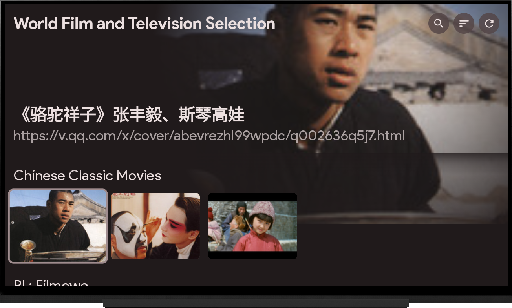
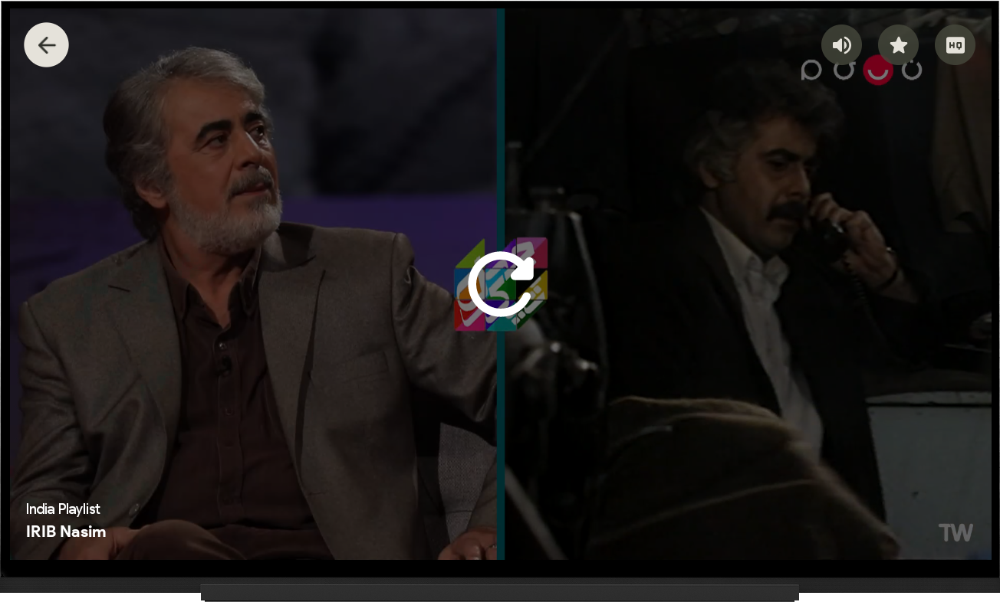

# M3UAndroid

<div align="center">

[](https://github.com/oxyroid/M3UAndroid/releases)
[](https://developer.android.com)
[](https://t.me/m3u_android)
[](LICENSE)

A modern IPTV streaming player built with Jetpack Compose for Android phones, tablets, and TV devices.

</div>

## Features

- **Multi-Platform** — Dedicated UIs for smartphones, tablets, and Android TV
- **M3U & Xtream** — Subscribe to `.m3u`/`.m3u8` playlists or authenticate via Xtream Codes API (live TV, VOD, series)
- **EPG** — XML-based Electronic Programme Guide with auto-sync and reminders
- **DLNA Casting** — Stream to any UPnP/DLNA device on your local network
- **FFmpeg Codecs** — Optional FFmpeg codec pack (nextlib) for extended format support
- **Smart Playback** — HLS, DASH, RTSP, RTMP, SmoothStreaming via Media3/ExoPlayer
- **Remote Control** — Use your phone as a remote for Android TV via WebSocket
- **Picture-in-Picture** — Background playback on smartphones
- **App Widget** — Glance-based home screen widget
- **No Ads** — Minimal permissions, open source, GPL 3.0

## Screenshots

<table>
<tr>
<td width="50%">

**Mobile**


</td>
<td width="50%">

**Android TV**




</td>
</tr>
</table>

## Download

[](https://github.com/oxyroid/M3UAndroid/releases/latest)
[](https://f-droid.org/packages/com.m3u.androidApp)
[](https://apt.izzysoft.de/fdroid/index/apk/com.m3u.androidApp)

**Nightly builds** available via [GitHub Actions artifacts](https://nightly.link/oxyroid/M3UAndroid/workflows/android/master/artifact.zip).

## Tech Stack

| Category | Technology |
|---|---|
| Language | 100% Kotlin |
| UI | Jetpack Compose + Material Design 3 |
| Architecture | MVVM, strict layered modules |
| Async | Kotlin Coroutines + Flow |
| DI | Hilt |
| Database | Room (schema v20) |
| Networking | Retrofit + OkHttp + kotlinx-serialization |
| Media | Media3 / ExoPlayer + nextlib (FFmpeg) |
| Background | WorkManager |
| In-app server | Ktor (TV remote control) |
| DLNA | mm2d-mmupnp |
| Image | Coil |

## Module Structure

```
app/
  smartphone/     # Phone & tablet app (versionName 1.15.1)
  tv/             # Android TV app (versionName 1.0.1)
  extension/      # Extension stub APK

business/         # Feature ViewModels & state
  foryou / favorite / playlist / playlist-configuration / channel / setting / extension

core/
  foundation/     # Shared primitives, DataStore, UI helpers, types
  extension/      # Extension contracts & RemoteService

data/             # Room DB, repositories, parsers (M3U/Xtream/EPG), Media3, workers

i18n/             # String resources for 12+ locales
lint/             # Custom KSP annotations & processor
testing/          # Benchmarks & mock server
```

## Building

Requirements: JDK 17, Android SDK with compile SDK 36.

```bash
# Debug build (smartphone)
./gradlew :app:smartphone:assembleDebug

# Release build (all ABI splits)
./gradlew :app:smartphone:assembleRelease

# TV debug build
./gradlew :app:tv:assembleDebug

# Run connected tests
./gradlew connectedAndroidTest
```

## Localization

Contributions welcome! Currently supporting:

- 🇬🇧 [English](i18n/src/main/res/values) · 🇨🇳 [简体中文](i18n/src/main/res/values-zh-rCN)
- 🇫🇷 [Français](i18n/src/main/res/values-fr-rFR) · 🇩🇪 [Deutsch](i18n/src/main/res/values-de-rDE)
- 🇮🇩 [Indonesia](i18n/src/main/res/values-id-rID) · 🇮🇹 [Italiano](i18n/src/main/res/values-it-rIT)
- 🇧🇷 [Português (BR)](i18n/src/main/res/values-pt-rBR) · 🇷🇴 [Română](i18n/src/main/res/values-ro-rRO)
- 🇪🇸 [Español](i18n/src/main/res/values-es-rES) · 🇸🇪 [Svenska](i18n/src/main/res/values-sv-rSE)
- 🇹🇷 [Türkçe](i18n/src/main/res/values-tr-rTR)

## Contributing

Pull requests and issues are welcome. Before contributing:

1. Read `AGENTS.md` (root) and the nested `AGENTS.md` in the layer you are changing.
2. Keep changes narrowly scoped — no mixing refactors into feature PRs.
3. Room schema changes require a migration file and updated schema artifact.
4. All new code must be Kotlin only; no star imports; no inline dependency versions.

## Community

- **Telegram Channel** — [t.me/m3u_android](https://t.me/m3u_android)
- **Telegram Chat** — [t.me/m3u_android_chat](https://t.me/m3u_android_chat)

## License

This project is licensed under the [GNU General Public License v3.0](LICENSE).
